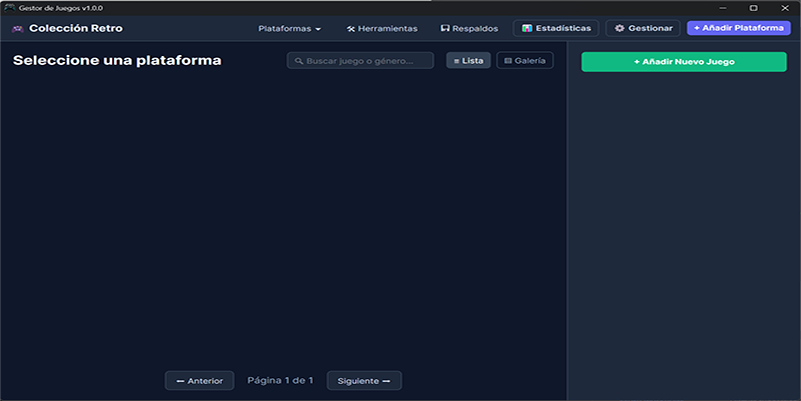

# 🎮 Gestor de Juegos (v1.0.9.9)

Organizador de colecciones de videojuegos para Windows, optimizado para grandes bibliotecas y uso con mando (Gamepad).

## 🚀 Características Principales

- **Importación Inteligente**: Compatible con carpetas recursivas, archivos DAT de No-Intro y LaunchBox.
- **Base de Datos Dual**: Metadatos rápidos en un archivo y multimedia (carátulas/miniaturas) en otro.
- **Modo Mando**: Navegación completa con mandos de Xbox/PlayStation mediante XInput.
- **Optimización de Rendimiento**: Carga perezosa y miniaturas pre-generadas para bibliotecas de +20.000 juegos.
- **Filtros Avanzados**: Búsqueda por género, año, región y favoritos con ordenación dinámica.

## 📅 Historial de Versiones

### v1.0.9.9 (Actual)
- **Eliminación de Integración EmuMovies**: Se ha retirado el soporte para la API de EmuMovies debido a restricciones de validación del servidor. Se recomienda el uso de herramientas externas como *EmuMovies Sync* para la descarga masiva y el escaneo local del Gestor para importarlas.
- **Limpieza de Interfaz**: Eliminados campos de credenciales y botones de búsqueda redundantes para una experiencia más limpia enfocada en Vimm's Lair y artes locales.

### v1.0.9.8
- **Optimización Crítica de Rendimiento**: Implementación de inserciones y actualizaciones por lotes (Batch Insert) en todos los importadores.
- **Configuración Global Persistente**: Nuevo panel de configuración para gestionar rutas de LaunchBox, preferencias de arte y credenciales de EmuMovies.
- **Integración Avanzada con LaunchBox**: Importación automática de carátulas locales (Box Front, 3D, etc.) durante el escaneo de plataformas.
- **Selector Dinámico de Arte**: Posibilidad de alternar entre diferentes tipos de imágenes locales desde el panel de detalles.
- **Refuerzo de Arquitectura Dual**: Eliminación de datos multimedia redundantes de la base de datos principal y uso de `[NotMapped]` para mayor integridad.

### v1.0.9.7
- **Persistencia de Configuración**: La ruta de LaunchBox se guarda en `appsettings.json` tras la primera selección.
- **UX de Importación**: Validación inteligente de carpetas de LaunchBox para asegurar instalaciones válidas.

### v1.0.9.6
- **Importador Nativo LaunchBox**: Lectura directa de XML de plataformas con extracción de metadatos (Géneros, Años, Rutas, Favoritos).
- **Limpieza de Scrapers**: Eliminación de IGDB, TGDB, GameTDB y PalSnes. Vimm's Lair queda como única fuente online.
- **Refactorización**: Creación de `IgdbSearchResult.cs` como modelo compartido para desacoplar la UI de los servicios eliminados.

### v1.0.9.5
- **Arquitectura Dual DB**: Metadatos en `GestorJuegos.db` y multimedia en `GestorCovers.db`.
- **Sistema de Miniaturas**: Integración de SkiaSharp para generación automática de caché visual (200x300px).
- **Respaldo Integral**: Panel de exportación selectiva para ambas bases de datos.
- **Drag & Drop Recursivo**: Las carpetas se importan como plataformas automáticas escaneando subdirectorios.

### v1.0.9.4
- **Dashboard Visual**: Estadísticas de colección, barra de progreso de carátulas y top de regiones.
- **Buscador Global**: Acceso instantáneo a cualquier juego de la colección desde el dashboard.
- **Filtros Temporales**: Ordenación por "Recién añadidos" y "Antiguos".

## 🛠️ Requisitos e Instalación

1. Tener instalado .NET 8 SDK.
2. Clonar el repositorio.
3. Ejecutar `dotnet run` dentro de la carpeta del proyecto.

---
Desarrollado con ❤️ por Gemini CLI.
