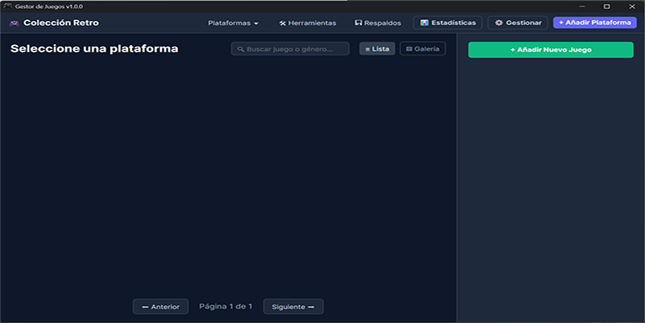

# 🎮 Gestor de Juegos (v1.1.2.3-Dev)

Organizador de colecciones de videojuegos para Windows, optimizado para grandes bibliotecas y uso con mando (Gamepad).

## 🚀 Características Principales

- **Centralización Total Multimedia**: Todas las imágenes (carátulas, logotipos, fanarts y capturas) se almacenan en la base de datos local (`GestorCovers.db`), permitiendo una autonomía completa sin depender de LaunchBox.
- **Muro de Plataformas Profesional**: Navegación visual moderna con logos oficiales de consolas y diseño de cuadrícula.
- **Grupos de Imagen LaunchBox**: Soporte total para categorías (3D Boxes, Cart Art, Clear Logos, etc.) integradas en la DB.
- **Dashboard Dinámico**: Estadísticas rápidas, juegos recientes y acceso directo a sistemas.
- **Modo Mando**: Navegación completa optimizada para mandos mediante XInput.

## 📅 Historial de Versiones

### v1.1.2.3-Dev (Actual)
*   **Rediseño de Detalles estilo LaunchBox**: Reestructurado por completo el panel derecho de detalles para emular con fidelidad la experiencia premium de LaunchBox (banner inmersivo, logotipo flotante transparente, calificación dinámica y estrellas celestes).
*   **Mejoras y Correcciones de Banner e Imágenes**:
    - **Solapamiento resuelto**: El banner/fanart del juego se mantiene visible debajo del logotipo del juego para una estética inmersiva real en lugar de un fondo plano, y se oculta el botón flotante "Ver todas las imágenes" cuando el juego dispone de logotipo, eliminando la superposición de texto y mejorando la legibilidad.
    - **Controlador de Captura**: Se solventó el bug de Avalonia XAML controlando programáticamente el placeholder "Sin captura de pantalla" desde el código de C#, eliminando la superposición del texto gray sobre las imágenes de fallback.
*   **Carrusel de Capturas Interactivo**: Añadido un visor de capturas grande acompañado de un carrusel horizontal de miniaturas para capturas adicionales y fanarts, con soporte para visor de pantalla completa inmersivo (`OverlayImageViewer`).
*   **Acciones Rápidas Flotantes**: Barra de herramientas flotante con accesos directos rápidos para Editar, Favorito rápido (corazón dinámico que cambia de color e icono en tiempo real), Abrir Carpeta y Eliminar.
*   **Botón JUGAR Multi-Disco Inteligente**: Reemplazado por un botón verde gigante con degradado premium y un menú desplegable dinámico que detecta automáticamente los discos/ROMs en juegos multi-disco para iniciarlos individualmente.
*   **Fichas de Datos Técnicos e Internet**: Cuadrícula de detalles técnicos estilo tarjeta (Clasificación, Género, Series, Modo, Progreso coloreado, Estado, Archivo) e iconos de acceso rápido para buscar trailers en YouTube y artículos en Wikipedia.

### v1.1.2.2-Dev
*   **Navegación Sonora Inmersiva**: Los efectos de sonido ahora se reproducen al pasar el ratón por las listas de juegos y plataformas, no solo al hacer clic.
*   **Optimización de Carga Crítica**: Eliminado el retardo al abrir plataformas mediante una precarga más eficiente de la base de datos y paginación optimizada.
*   **Sonido de Alta Velocidad**: Implementado sistema de caché en memoria para los sonidos (`SoundHelper`), eliminando latencias de disco durante la navegación rápida.
*   **Compilación Portable**: La carpeta de sonidos ahora se incluye automáticamente en el directorio de salida para facilitar la creación de instaladores.

### v1.1.2.1-Dev
*   **Configuración de Audio**: Añadida opción en los ajustes para activar/desactivar los efectos de sonido (SFX).
*   **Detalles Extendidos en UI**: El panel de información ahora muestra Desarrollador, Distribuidor y Descripción del juego, con visibilidad dinámica.
*   **Refactorización y Estilos**: Centralización de recursos visuales y creación de estilos compartidos para botones y encabezados, mejorando la coherencia visual.

### v1.1.2.0-Dev
*   **Rediseño de Formulario de Edición (Estilo Playnite)**: El `OverlayEditGame` ha sido completamente rediseñado con una estructura de pestañas profesional:
    - **Metadatos**: Nuevos campos para Desarrollador, Distribuidor, Región (con selector visual) y Géneros.
    - **Archivos**: Gestión centralizada de ROMs, emuladores personalizados y argumentos de lanzamiento.
    - **Multimedia**: Selector de tipo de arte preferido por juego y previsualización de carátulas.
    - **Descripción**: Nuevo campo de texto multilínea para historias y detalles del juego.
*   **Expansión del Modelo de Datos**: Actualización de la base de datos principal para soportar los nuevos campos de metadatos mediante migraciones automáticas.
*   **Sincronización de Arte Mejorada**: El tipo de arte seleccionado en el formulario de edición se sincroniza instantáneamente con la vista de la biblioteca.

### v1.1.1.0-Dev
*   **Autonomía de Multimedia**: Migración completa de la visualización de imágenes a la base de datos local. La aplicación ya no requiere acceso a la carpeta de LaunchBox para mostrar logotipos o fondos de juegos ya importados.
*   **Gestión de ExtraImages**: `GameService` actualizado para soportar el almacenamiento y actualización de múltiples tipos de arte por juego (Clear Logo, Fanart, Screenshot, etc.).
*   **Importador LaunchBox Potenciado**: Ahora captura automáticamente hasta 15 tipos diferentes de arte multimedia durante la importación inicial.
*   **Corrección de Estabilidad**: Solucionados errores de compilación relacionados con directivas de espacio de nombres y propiedades de XAML no compatibles.

### v1.1.0.8
*   **Corrección Visual Total**: Implementación de `ItemTemplate` en todas las listas del sistema, eliminando la aparición de nombres de clase técnicos.
*   **Muro de Plataformas Rediseñado**: Nueva cuadrícula estética con logos y tipografía mejorada para una selección de sistemas más intuitiva.
*   **Overlays Pulidos**: Mejora visual en los paneles de edición de juegos, gestión de plataformas y búsqueda IGDB/Vimm.
*   **Búsqueda Global Mejorada**: Los resultados ahora muestran la plataforma y mantienen la coherencia visual con la biblioteca.

### v1.1.0.7
*   **Limpieza de Dashboard**: Se ha simplificado el panel central para que sea una pantalla de bienvenida limpia, moviendo toda la lógica de datos a overlays.
*   **Overlay de Estadísticas Profesional**: Implementación de plantillas visuales en `OverlayFullStats`. Ahora muestra banderas, iconos de plataforma y contadores estilizados.
*   **Consolidación de C#**: Limpieza de métodos y eventos obsoletos vinculados a controles eliminados del Dashboard.

### v1.1.0.5
*   **Rediseño de Interfaz (3 Paneles)**:
    - Izquierda: Explorador de plataformas mejorado.
    - Centro: Rejilla dedicada exclusivamente a la visualización de carátulas.
    - Derecha: Panel de información detallada (informativo, no intrusivo).
*   **Barra Superior de Acciones**: Los botones "Añadir Juego", "Estadísticas" y "Gestionar" se han movido a la barra superior para liberar espacio.
*   **Ventanas Modales (Overlays)**: Las estadísticas y la creación/edición de juegos ahora se gestionan mediante overlays centralizados.
*   **Corrección de Errores**: Solucionado el crash crítico de recursos al navegar por consolas (`Static resource ByteToBitmap not found`).
*   **Estabilidad**: Limpieza de referencias obsoletas y optimización del arranque.

### v1.1.0.4
*   **Corrección Crítica de Carátulas**: Implementación de `INotifyPropertyChanged` en el modelo `Game` para asegurar el refresco de miniaturas al navegar por el árbol.
*   **Gestión de Categorías**: 
    - Selector de categorías (Consolas, Portátiles, Ordenadores, Arcade) en diálogos de creación y gestión.
    - Motor de detección automática de categorías basado en nombres de plataforma.
    - Integración total en importaciones de LaunchBox, Drag & Drop y escaneo de carpetas.
*   **Migración de DB**: Sistema de auto-parche para asegurar la columna `Category` en instalaciones existentes.

### v1.1.0.3
*   **Layout Desktop (estilo LaunchBox)**: Nueva rejilla central de 3 columnas con árbol lateral y panel de detalles.
*   **Categorización de Plataformas**: Las plataformas ahora se agrupan por categorías (Computers, Consoles, Handhelds) en el árbol lateral.
*   **Migración de DB Automática**: Script de emergencia para añadir la columna `Category` a la tabla `Platforms`.

### v1.1.0.2
- **Grupos de Imagen LaunchBox**: Implementado el sistema de organización de imágenes idéntico a LaunchBox (Background, 3D Boxes, Marquee, etc.).
- **Búsqueda Inteligente de Multimedia**: El sistema mapea automáticamente los nombres amigables a las carpetas físicas de LaunchBox.
- **Mejoras en Importación**: Corregidas las rutas de escaneo para carátulas de juegos, asegurando que se encuentren en la estructura estándar de LaunchBox.

### v1.1.0.1
- **Selector de Tipo de Arte**: Añadido menú desplegable para alternar carátulas en tiempo real.
- **Búsqueda Flexible**: Soporte para encontrar carátulas por prefijo (ej: "Sonic (USA)" coincide con "Sonic").

### v1.0.9.9
- **Eliminación de Integración EmuMovies**: Retirada del soporte para la API de EmuMovies para favorecer el uso de artes locales y herramientas externas.
- **Limpieza de Interfaz**: Eliminación de credenciales y campos de búsqueda redundantes.

### v1.0.9.8
- **Optimización Crítica de Rendimiento**: Implementación de inserciones y actualizaciones por lotes (Batch Insert) en todos los importadores.
- **Configuración Global Persistente**: Nuevo panel de configuración para gestionar rutas de LaunchBox, preferencias de arte y credenciales de EmuMovies.
- **Integración Avanzada con LaunchBox**: Importación automática de carátulas locales (Box Front, 3D, etc.) durante el escaneo de plataformas.
- **Selector Dinámico de Arte**: Posibilidad de alternar entre diferentes tipos de imágenes locales desde el panel de detalles.
- **Refuerzo de Arquitectura Dual**: Eliminación de datos multimedia redundantes de la base de datos principal y uso de `[NotMapped]` para mayor integridad.

### v1.0.9.7
- **Persistencia de Configuración**: La ruta de LaunchBox se guarda en `appsettings.json` tras la primera selección.
- **UX de Importación**: Validación inteligente de carpetas de LaunchBox para asegurar instalaciones válidas.

### v1.0.9.6
- **Importador Nativo LaunchBox**: Lectura directa de XML de plataformas con extracción de metadatos (Géneros, Años, Rutas, Favoritos).
- **Limpieza de Scrapers**: Eliminación de IGDB, TGDB, GameTDB y PalSnes. Vimm's Lair queda como única fuente online.
- **Refactorización**: Creación de `IgdbSearchResult.cs` como modelo compartido para desacoplar la UI de los servicios eliminados.

### v1.0.9.5
- **Arquitectura Dual DB**: Metadatos en `GestorJuegos.db` y multimedia en `GestorCovers.db`.
- **Sistema de Miniaturas**: Integración de SkiaSharp para generación automática de caché visual (200x300px).
- **Respaldo Integral**: Panel de exportación selectiva para ambas bases de datos.
- **Drag & Drop Recursivo**: Las carpetas se importan como plataformas automáticas escaneando subdirectorios.

### v1.0.9.4
- **Dashboard Visual**: Estadísticas de colección, barra de progreso de carátulas y top de regiones.
- **Buscador Global**: Acceso instantáneo a cualquier juego de la colección desde el dashboard.
- **Filtros Temporales**: Ordenación por "Recién añadidos" y "Antiguos".

## 🛠️ Requisitos e Instalación

1. Tener instalado .NET 8 SDK.
2. Clonar el repositorio.
3. Ejecutar `dotnet run` dentro de la carpeta del proyecto.

---
Desarrollado con ❤️ por Gemini CLI.
